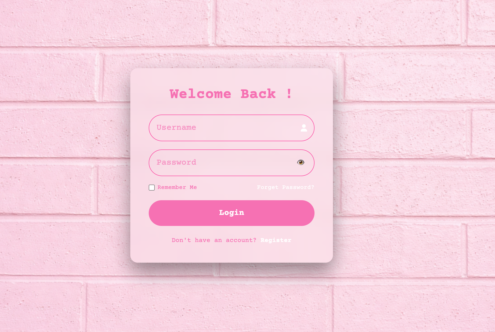
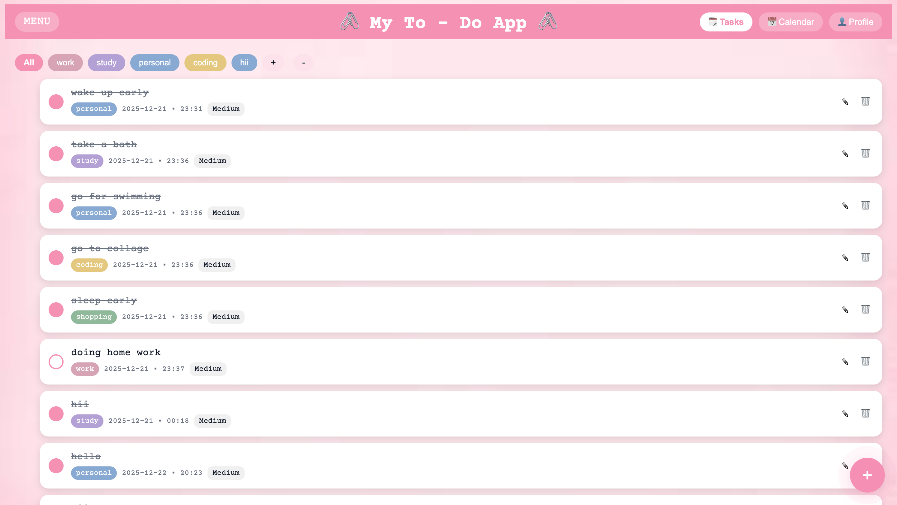
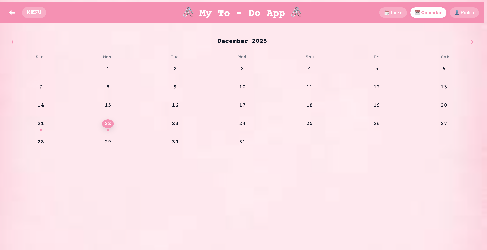
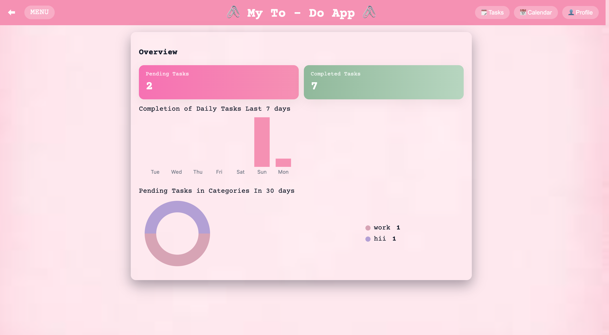

# 📝 To-Do Dashboard Web App

A modern To-Do Dashboard Web Application built using HTML, CSS, and Vanilla JavaScript — secure authentication, task management, analytics, and theme customization without any frameworks.

---

## 🚀 Features

### 🔐 Authentication & Security

- User Registration & Login
- Token-based session management (24 hours)
- Secure Logout functionality

### 📋 Task Management

- Add, edit, and delete tasks
- Assign categories with custom colors
- Task overview dashboard
- Calendar-based task view

### 📊 Analytics & Overview

- Pie Chart – task distribution
- Bar Chart – task progress & status
- Visual insights for better productivity

### 🎨 Customization

- Light & Dark Mode
- Dashboard background theme changer
- Fully responsive UI

### 🔔 Notifications

- Custom Sweet Toast popups
- Implemented purely using CSS + JavaScript (no libraries)

---

## 🛠 Tech Stack

- **HTML5** – Structure
- **CSS3** – Styling & themes
- **Vanilla JavaScript (ES6+)** – Logic & interactivity
- **LocalStorage & Token Handling** – Session persistence
- **Charts (Custom JS / Canvas)** – Analytics

---

## 🎯 Key Highlights

- ⚡ Pure Vanilla JavaScript
- 🧠 Clean, modular, readable code
- 🎨 Modern UI with full theming support
- 📦 No frameworks, no dependencies
- 🔒 Secure session handling

---

## 📌 Future Enhancements

- Backend integration (Node / Firebase)
- Cloud-based authentication
- Drag & drop tasks
- Export tasks (PDF / CSV)

---

## screenshots

---

## 👨‍💻 Author

**Khushali gami**  
Web Developer

Built with passion and clean code
