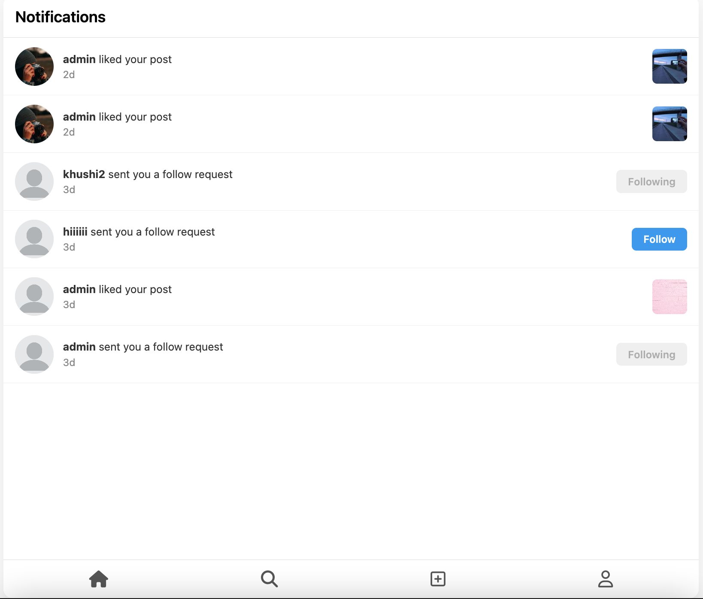
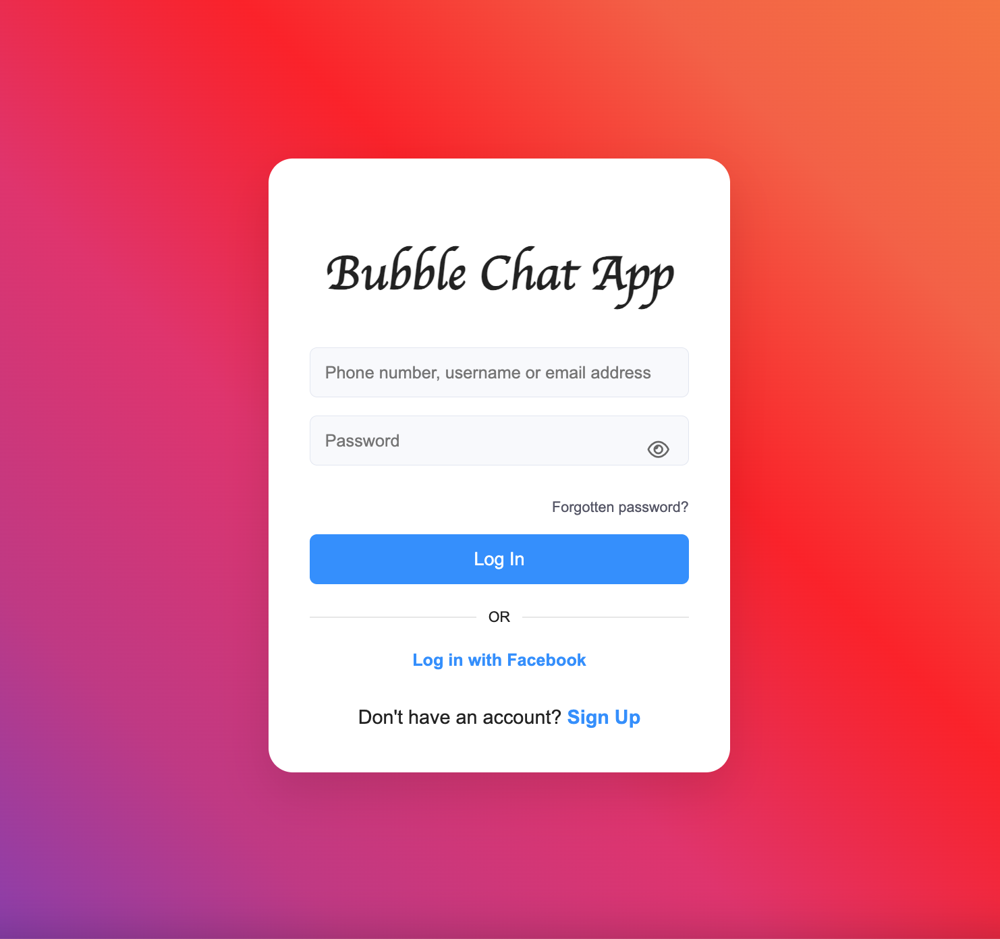
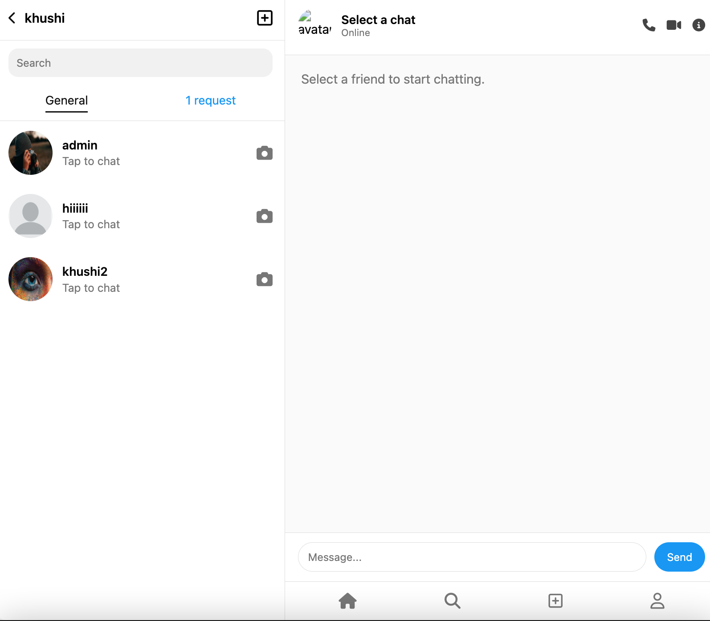
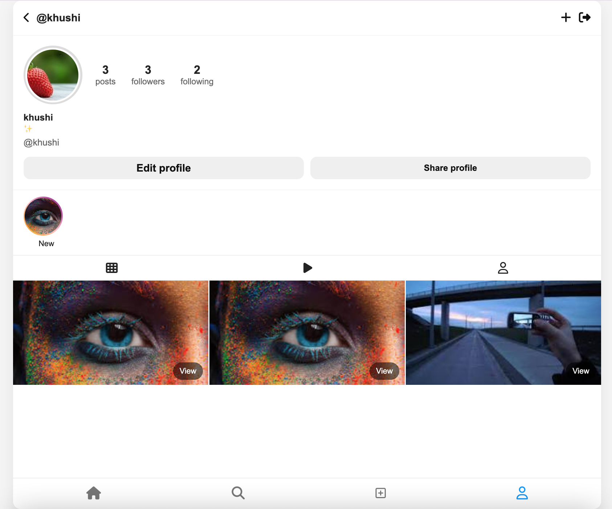

# Instagram Clone (Bubble Chat App)

A full‑stack Instagram‑style clone with posts, stories, chat, notifications, profiles, and follow system. The project includes a Node/Express backend with MongoDB and a multi‑page frontend UI that mimics core Instagram interactions.

## Features

### Authentication & Profiles

- Register and login with JWT auth
- Editable profile (name, avatar, bio)
- View own profile and other users’ profiles
- Share profile via QR code

### Posts

- Create posts with image, caption, location, and music
- View posts feed (own + following)
- Like/unlike posts with live counter and pink heart state
- Edit caption/location/music and delete posts

### Stories

- Add stories (image) with 24‑hour expiration
- Multi‑story viewer per user with next/prev controls
- Viewed state persists and removes highlight ring
- Story delete for own stories

### Follow System

- Follow requests and approvals
- Followers/following lists and counts
- Unfollow and remove follower

### Notifications

- Like, comment, follow request, and follow notifications
- Red dot indicator on notification icon when unread
- Notifications list with quick follow actions

### Chat

- Real‑time chat using Socket.IO
- Messages list and conversation view

### UI/UX

- Modern mobile‑first layout
- Fixed bottom navigation
- Modals for post creation, story viewer, and options menus

## Tech Stack

- **Backend:** Node.js, Express, MongoDB, Mongoose, JWT, Multer, Socket.IO
- **Frontend:** HTML, CSS, Vanilla JavaScript

## Screenshots







## Project Structure

```
backend/
  config/
  middleware/
  models/
  routes/
  socket/
  server.js
frontend/
  css/
  js/
  *.html
```

## Run Locally

1. Install backend dependencies and start the server.
2. Open the frontend pages (e.g., `frontend/home.html`) in your browser.

> Backend runs at `http://localhost:5000` by default.
# CodeAlpha_instagram_clone
# CodeAlpha_instagram_clone
